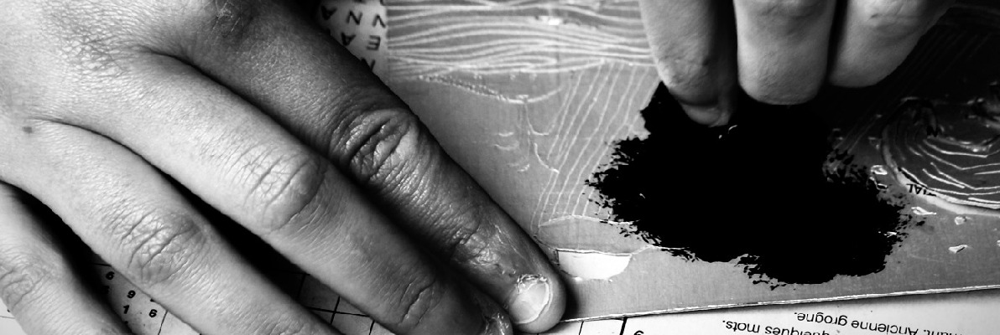

+++
title = "Cours"
+++
# À la rentrée, viens graver avec les 3 citrons ! 

En complément des [cours ponctuels](https://www.helloasso.com/associations/l-atelier-des-3-citrons/boutiques/ateliers-et-cours-de-gravure), les artistes de l'atelier des 3 citrons 
proposent pour l'année 2024/2025 un cours de gravure au trimestre multi-
techniques **un jeudi sur deux** au **Pôle jeunesse de Quéven** à destination des
adolescents et adultes.

Au programme : gravure à la pointe sèche sur tetrapak et rhenalon, burin,
linogravure, collagraphie : un parcours varié pour s’initier à la magie de 
l’image imprimée à partir d’une matrice. Chaque artiste vous fera découvrir
les spécificités d’une technique et vous invitera à entrer dans son processus 
créatif.

Tout commence avec une séance découverte ouverte à tous le jeudi 12
septembre, en présence des artistes.
 
 

 
 
## Demandez le programme !

### Premier trimestre

 - Séance découverte gratuite en présence des artistes : jeudi 12/09
 -  Pointe sèche sur Tetrapak et Rhenalon avec [Clého](https://www.instagram.com/cleho_estampe/) : jeudis 19/09, 03/10, 17/10, 07/11, 21/11
 -  Burin avec [Léo](https://www.instagram.com/leopaulcreations/) : jeudis 05/12, 19/12

### Deuxième trimestre

 - linogravure avec [Maštabilo](https://www.instagram.com/mastabilo/) : jeudis 9/01, 23/01, 6/02
 - linogravure avec [Sarah](https://www.instagram.com/s.c.arah.bee/) : jeudis 27/02, 13/03, 27/03

### Troisième trimestre

 - linogravure avec les [Cas Brassés](https://www.instagram.com/les.cas.brasses/) : jeudi 24/04, mercredi 7/05, jeudi 22/05
 - collagraphie avec [Clého](https://www.instagram.com/cleho_estampe/) : jeudis 5/06, 19/06

### Cours de 19 h à 22 h au Pôle jeunesse, 5 rue de la gare, à Quéven.

### Tarif : 400€ l'année ou 150€ le trimestre + 10€ d'adhésion annuelle à l'association

Renseignements et inscriptions : atelier@3citrons.art et au forum des associations de Quéven le 7 septembre, 13h-18h

