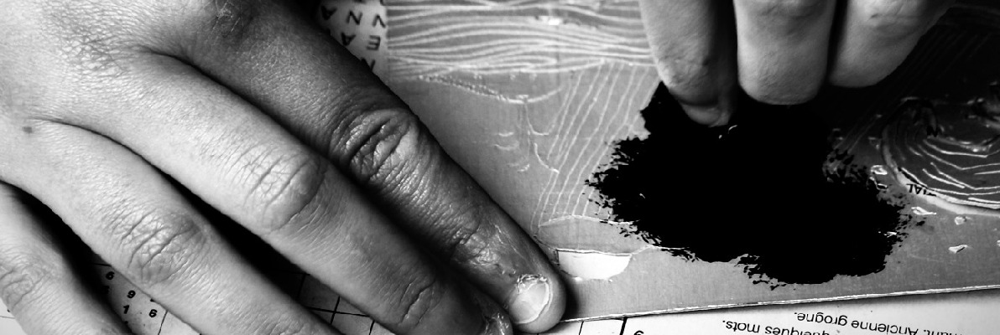

+++
title = "Cours 2026/2027"
+++


## Toi aussi, viens graver avec les 3 citrons ! 

Pour la troisième année consécutive, l'atelier des 3 citrons vous propose de découvrir les joies de la gravure et de l'image imprimée.

**Cours du mardi avec Léo** : complet  
Au programme : gravure sur bois, gravure sur cuivre et réalisation d'un livre d'artiste avec les images de l'année.

**Cours du jeudi avec Clotilde** : pré-inscription par mail atelier@3citrons.art  
Au programme : linogravure, pointe sèche et eau-forte sur cuivre.

**Cours découverte gratuit, ouvert à tous·tes** : mardi 8 septembre, 19h



### Où ? Au Baratin/Pôle jeunesse, 5 rue de la gare, Quéven

### Public adulte, groupes de 5 personnes, 19h -22h

450€ l'année, 170€ le trimestre, 60€ la séance, + adhésion à l'association de l'atelier des 3 citrons : 10€ pour l'année scolaire 2026-2027




 

