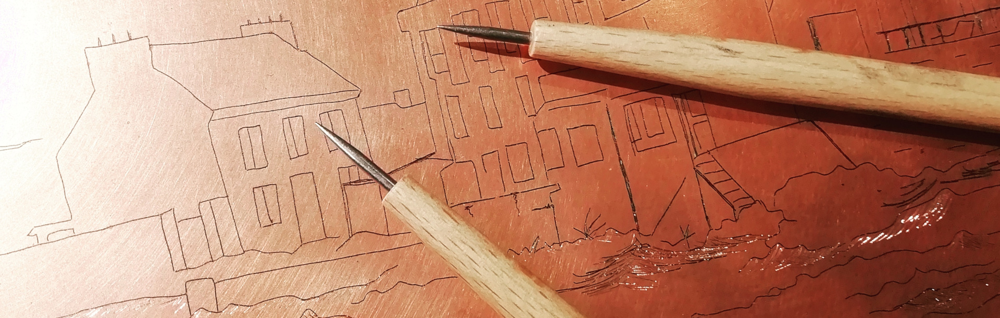
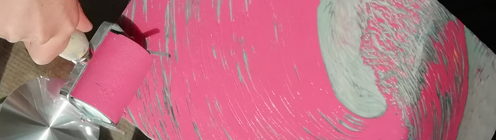
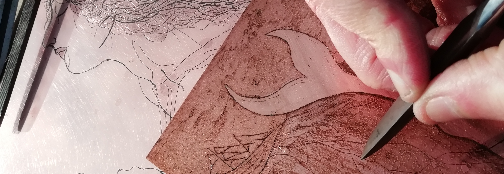

+++
title = "L'atelier"
+++
# coucou, c'est *l'atelier des 3 citrons*

L'atelier des 3 citrons est un atelier de gravure associatif
et un collectif d'artistes graveurs. 

Le but ? [Graver ensemble](#on-va-tous-graver) — parce qu'à plusieurs on grave plus loin ;
échanger et [transmettre](#transmettre) la diversité des techniques dans la joie et la
bonne humeur !

## On va tous graver !

Les graveurs expérimentés sont les bienvenus à l’atelier des 3 citrons
pour mener à bien leurs recherches artistiques, en toute autonomie
(voir les [formules de pratique
libre](https://www.helloasso.com/associations/l-atelier-des-3-citrons/boutiques/pratique-libre-gravure)).

Ils peuvent utiliser les outils et la chimie mis à disposition par
l’association, notamment une [presse taille-douce
Reig](https://reig-beaux-arts.fr/fr/catalogue-de-presses-a-gravure-et-outils-professionnels-pour-graver/54-torculo.html)
dotée d’un plateau de 55 x 120 cm. Sont aussi disponibles des outils
pour la taille-douce directe, des gouges pour la taille d’épargne, la
chimie pour l’eau-forte sur cuivre (vernis, colophane pour les
aquatintes, perchlorure de fer pour les morsures) et une table
d’encrage chauffante.

## Transmettre

 Les artistes du collectif proposent [des
 cours](https://www.helloasso.com/associations/l-atelier-des-3-citrons/boutiques/ateliers-et-cours-de-gravure)
 pour toute personne souhaitant s’initier au plaisir magique de graver
 et imprimer. Dans le cadre intimiste de l’atelier, ces cours en petit
 comité (maximum deux élèves) sont l’occasion de s’initier à la
 gravure en maniant gouges et pointes pour la première fois. Ils et
 elles interviennent aussi en milieu scolaire, périscolaire ou toute
 autre structure souhaitant faire découvrir la gravure à ses usagers.

L’atelier des 3 citrons participe régulièrement à des événements pour
faire découvrir la gravure et les œuvres des artistes du collectif :
expositions, festivals, rencontres...

## Infos pratiques

Contactez-nous par [mail](mailto:atelier@3citrons.art) ou sur
[instagram](https://www.instagram.com/atelier_3_citrons/) à toutes
fins utiles !

[L’adhésion annuelle à
l’association](https://www.helloasso.com/associations/l-atelier-des-3-citrons/adhesions/adhesion)
(10 euros) est obligatoire pour participer aux activités proposées à
l’atelier.

L’atelier des 3 citrons est installé à Quéven, dans le Morbihan, près de Lorient.

- En voiture : N165, sortie Quéven, stationnement possible dans la rue. 
- En bus : T4 en provenance de Lorient, arrêt Bel Air (ou Ville de Toulouse en marchant un peu).
- À vélo : depuis Lorient, Plœmeur et Pont Scorff, itinéraires sur voies cyclables dédiées, abri vélo disponible sur place.

