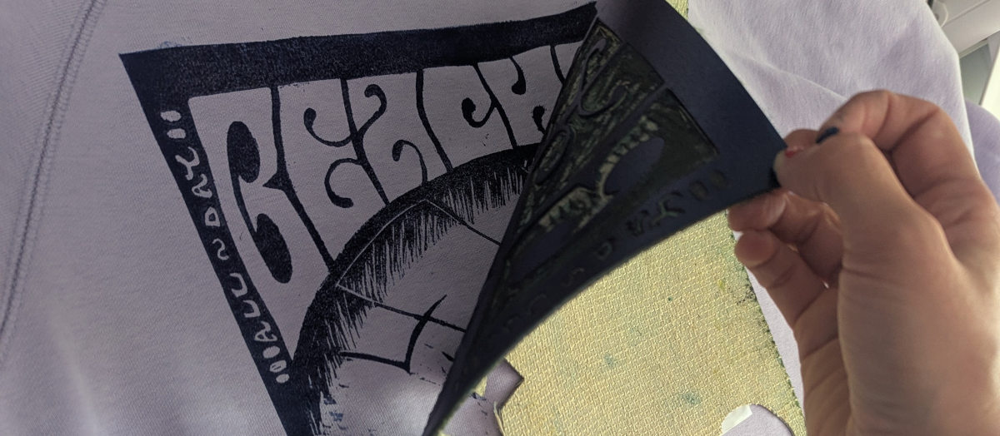
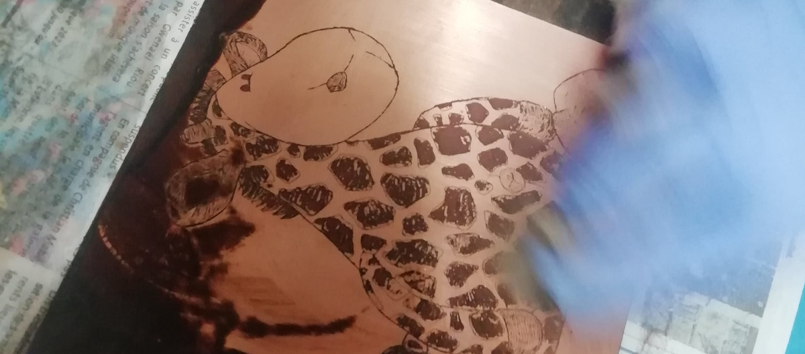
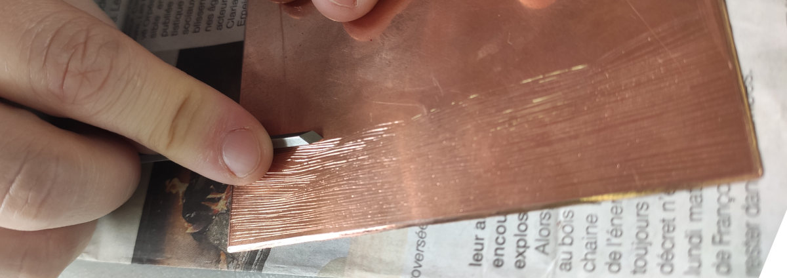
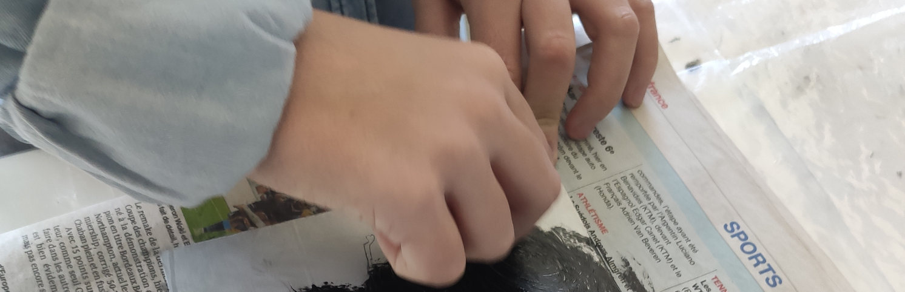
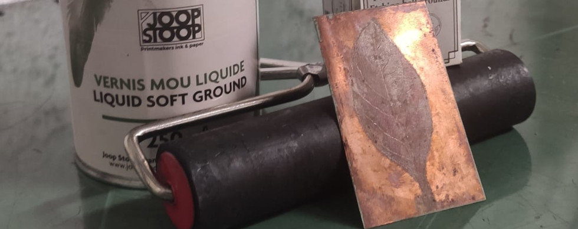

+++
title = "Cours 2026/2027"
+++



## Des stages pour encore plus d'images !

Nouveauté de l'année, 5 stages "week-ends" pour découvrir ou approfondir la pratique d'une des techniques de gravure pendant deux jours.

### 3 et 4 octobre : linogravure · impression textile avec Sarah

### 14 et 15 novembre : eau-forte avec Clotilde 
Comme dirait notre élève-présidente préférée « Viens, ça va être super parce qu'on va tous graver, bordel ! ». Et que va-t-on graver cette fois-ci ?  
Ce stage sera l'occasion de pratiquer la gravure à l'eau-forte, c'est à dire par la morsure d'une plaque de suivre dans un produit chimique qui creuse l'image. Et c'est beaucoup plus clair quand on le fait que quand on en parle !

### 30 et 31 janvier : burin avec Léo 
Pendant deux jours, ce stage va vous permettre de découvrir sereinement et dans la bonne humeur cette technique ancestrale de gravure en taille douce.
Cette façon de graver permet, avec la simple utilisation d'un outil, de traits et de points, d'exprimer toutes sortes d'univers : abstraits, figuratifs, sobres ou foisonnants de détails, tous les styles sont possibles !  
Nous prendrons ce temps presque méditatif pour appréhender sereinement une technique exigeante mais accessible à toutes et tous. Je vais vous donner les clefs pour comprendre la prise en main de l'outil, son entretien avec la partie essentielle de l'affûtage et vous accompagnerai dans la création d'une estampe qui vous ressemble.  
Après cela, rien ne vous empêchera de l'adopter pour votre propre pratique artistique.

### 3 et 4 avril : minis stages adulte-enfant(s) avec Clotilde 
On va tous graver, ça commence tout petit déjà et ça dure longtemps… et même on peut le faire tous ensemble !  
Alors de 7 à 777 ans, venez passer ensemble quelques heures les mains dans l'encre avec Clotilde pour imprimer vos premières (ou pas premières) images gravées à la pointe sèche sur brique alimentaire.  Papas-mamans, tatas-tontons, parrains-marraines, papis-mamies, à vous de jouer !

### 29 et 30 mai : eau-forte au vernis mou avec Léo
Cette méthode de gravure en de taille douce permet de réaliser des images à la manière du dessin : le geste est celui du crayonné, les traits légers se superposent sur la plaque de cuivre et construisent des images tout en douceur, comme un pastel ou une étude à la mine de plomb.  
Nous allons, ensemble et dans la bienveillance, prendre ce temps d'expérimentation, entre dessin, chimie et impressions sur la presse, afin de mieux comprendre une façon méconnue de graver, et de révéler les images qui nous animent. 



## Infos pratiques
Pour tous les stages, pas de pré-requis, tout le matériel est fourni et les stages ont lieu à la Grange de Kerdélann à Quéven.

### Stages adulte 
À partir de 12 ans  
Samedi et dimanche, 10h-17h avec pause déjeuner d'une heure (possiblité de déjeuner sur place)  
Tarifs : 145€ puis dégressif 130€ le deuxième et 125€ le troisième et le quatrième + 10€ d'adhésion à l'association pour l'année 2026-2027

### Stage adulte-enfant(s) 
À partir de 7 ans  
Samedi ou dimanche 14h – 17h  
Tarifs : 40€ adulte ; 20€ enfant ; 15€ (le deuxième enfant) + 10€ par adulte et 5€ par enfant d'adhésion à l'association pour l'année 2026-2027




